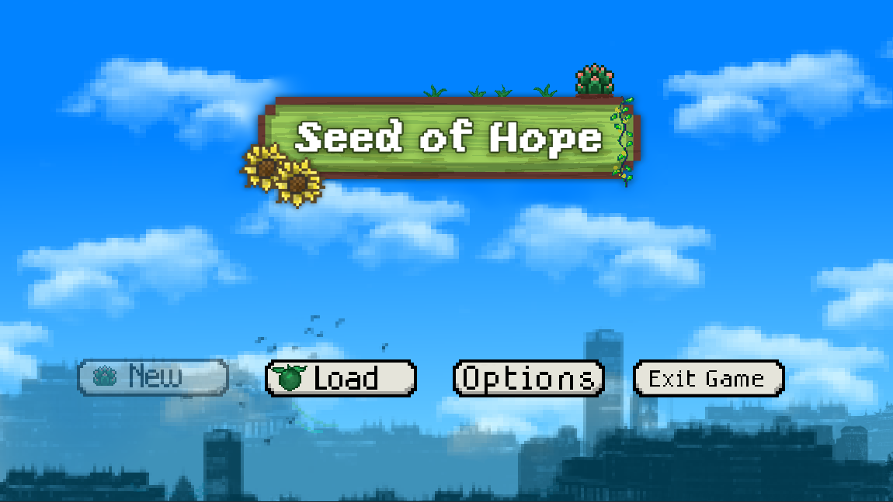

Welcome to Seed of Hope!

Developers
Astudillo, Zydney - Frontend

Bautista, Gaia - Backend

Caday, Sofia Faith - Frontend

Cruz, Alexandra - Backend

Cruz, Cristian James - Coder

Esquivel, Municht - Coder

This is our mini game project which features growing your own plants!

We took inspiration during pandemic era where people are just stuck to their house 
and got nothing to do. However during those times there people who took the hobby 
of taking care of plants. What we call "Plantita" and "Plantito"

Language Used : C#

Framework : Godot Engine

Document Database: Json

How to Import to your GODOT game engine?
1. Download our ZIP file and extract the folder to desired place  | Clone for Developers
2. Open your godot engine and click  "Import Project"
3. Look for the Extracted Folder
4. Enjoy Developing

here is the clone link:
git clone https://github.com/CJ-Zurc/Seed-of-Hope.git
